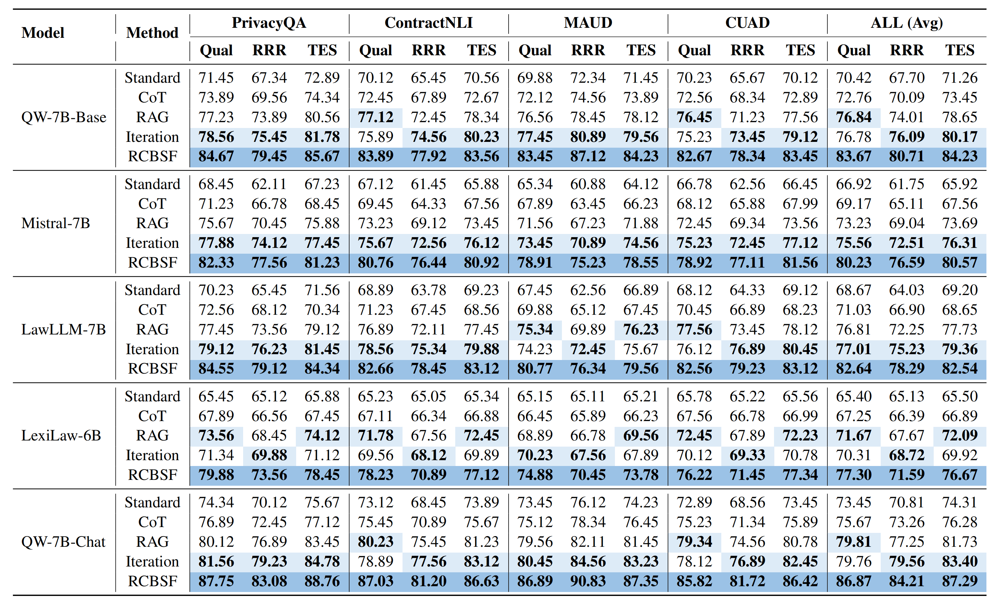

<div align="center">

# RCBSF: A Multi-Agent Framework for Robust Contract Construction via Stackelberg Leader-Follower Game

[Code](./src)

</div>

## 📌 Table of Contents
- [🌟 Introduction](#-introduction)
- [🛠️ Installation](#️-installation)
- [🚀 Quick Start](#-quick-start)
- [📦 Dataset](#-dataset)
- [🔁 Reproducing our Experiments](#-reproducing-our-experiments)
- [🧭 Usage Instructions](#-usage-instructions)
  - [1. Environment Preparation](#1-environment-preparation)
  - [2. Directory Structure](#2-directory-structure)
  - [3. Command Line Arguments](#3-command-line-arguments)
- [🙏 Acknowledgments](#-acknowledgments)
- [📝 License](#-license)
---

## 🌟 Introduction

Automated legal contract revision requires a delicate balance between **Risk Mitigation** and **Semantic Preservation**. However, conventional LLM strategies often encounter two types of issues:
- **Hallucinated Safety Guarantees**: Adding promises or clauses out of thin air that are not supported by the original text.
- **Redundant Revisions**: Introducing large amounts of repetitive or irrelevant content in pursuit of safety, thereby reducing the professionalism and readability of the contract.

To address this, the paper proposes **RCBSF (Risk-Constrained Bilevel Stackelberg Framework)**: formalizing contract revision as a **bilevel Stackelberg Leader–Follower game**.

*Figure 1: Framework comparison and overall process schematic. (a) Traditional/Baseline contract revision is typically a static, one-way template stitching process, easily ignoring implicit risks; (b) RCBSF models revision as a Leader–Follower bilevel optimization, utilizing a closed loop of Risk Extraction → Multi-round Revision-Audit → Loss Assessment to make the revision process more dynamic, robust, and lower in risk.*

- **Leader: Global Prescriptive Agent (GPA)** first conducts a risk audit, extracting risk types and mapping weights to form a global strategy of risk priorities + resource constraints.
- **Follower System** consists of two types of sub-agents:
  - **CRA: Constrained Revision Agent** executes revisions within the constraints.
  - **LVA: Local Verification Agent** performs local verification on revision results, identifies residual risks, and generates feedback.
  Through multiple rounds of the **Revision–Audit** loop, residual risks are progressively reduced while maintaining semantic consistency and text quality as much as possible.


Across multiple legal datasets and different base models, RCBSF demonstrates stable advantages in metrics such as **Risk Reduction, Overall Quality, and Fidelity** (compared to standard / CoT / RAG / Iterative strategies), verifying the effectiveness of this risk-constrained + multi-round audit feedback mechanism for contract revision tasks.


*Figure 2: Overview of main experimental results. The table compares various methods across datasets (PrivacyQA / ContractNLI / MAUD / CUAD) and metrics (Quality / Risk Reduction / Comprehensive Score, etc.); RCBSF achieves superior performance in most settings, demonstrating consistent improvement across different models and contract scenarios.*

This repository provides:
- Data processing scripts: Generating **standardized templates** and **risk categories** from raw contract text.
- RCBSF main process implementation: `src/run_rcbsf.py`.
- Two-stage evaluation scripts: `src/evaluation/*` (for reproducing the calculation flow of experimental metrics).

---

## 🛠️ Installation

### 1) Create Environment (Conda Recommended)
```bash
conda create -n rcbsf python=3.11 -y
conda activate rcbsf  

```

### 2) Install Dependencies

```bash
pip install -r requirements.txt

```

> **Note**
> * The paper's experiments are based on the Python 3.11 + PyTorch ecosystem; this repository recommends the same combination by default.
> * If you plan to use `.gguf` models as an Evaluation Judge, you need the additional dependency `llama-cpp-python` (already listed in requirements).
> 
> 

---

## 🚀 Quick Start

### Step 0: Prepare Local LLM Weights (For RCBSF Main Process)

This repository defaults to loading local models via `transformers` (e.g., the Qwen-2.5-* series). Please set:

* Environment variable `QWEN_MODEL_PATH` pointing to your local model directory (or pass explicitly via `--model`).

```bash
export QWEN_MODEL_PATH=/path/to/your/Qwen2.5-Chat
# Or pass as an argument at runtime: --model /path/to/your/Qwen2.5-Chat

```

### Step 1: Prepare Input Data (Minimal Runnable Example)

The RCBSF main process requires input as:

* A directory (containing multiple `.json`/`.jsonl` files), or
* A single `.json`/`.jsonl` file.

Each sample must minimally contain:

```json
{
  "case_id": "xxx",
  "contract_text": "...",
  "risk_categories": ["...", "..."]
}

```

You can use the `process_data` script in this repository to generate the above structure from raw `.txt` contracts (see Dataset section below).

### Step 2: Run RCBSF

```bash
python src/run_rcbsf.py   --data ./out/stage2_enriched   --out_dir ./outputs/rcbsf   --outer_rounds 3   --seed 42

```

After running, result files with the same name as `case_id` will be generated in `--out_dir`:

* `outputs/rcbsf/<case_id>.json`

---

## 📦 Dataset

### 1) Benchmark Data Sources (Paper Settings)

The paper's unified benchmark is constructed from 4 high-quality legal NLP datasets: **PrivacyQA, ContractNLI, MAUD, CUAD**, covering various contract scenarios like privacy policies, NDAs, and merger agreements.The dataset is detailed in the [reproduce](./reproduce).

### 2) Template Standardization and Risk Enrichment (Recommended Script)

Raw legal documents often contain PII and formatting noise. The paper employs a **Template Standardization Pipeline**:

* **Stage 1: Template Standardization**
Rewrites raw contracts into clear, anonymized, structurally consistent contract templates (limiting word count and format, outputting plain text).
* **Stage 2: Risk Enrichment**
Generates 8–12 executable high-level risk categories based on the template for subsequent auditing and evaluation.

This repository provides the corresponding script: `src/process_data/process_data.py`
Input requirement: Organize raw contracts as `*.txt` (one file per contract).

```bash
# OpenAI Key required (for calling OpenAI API to generate templates/risk categories)
export OPENAI_API_KEY="your_api_key"

python src/process_data/process_data.py   --input_dir ./data/contracts   --templates_out_dir ./out/stage1_templates   --enriched_out_dir ./out/stage2_enriched   --template_model gpt-4o-mini   --risk_model gpt-4o-mini

```

Output:

* `out/stage1_templates/*.json`: `{case_id, contract_text}`
* `out/stage2_enriched/*.json`: `{case_id, contract_text, risk_categories}` (Directly readable by RCBSF)

---

## 🔁 Reproducing our Experiments

> **Paper Experiment Settings Highlights (For alignment/reproduction)**
> * Python 3.11 + PyTorch ecosystem
> * Experiments completed on an 8× NVIDIA A100 (80GB) cluster
> * Generation process uses a fixed random seed `seed = 42`
> * Evaluation includes three categories of metrics: Contract Quality (0-100), Risk Resolution Rate (RRR), Token Efficiency Score (TES)
> 
> 

### 1) Run RCBSF (Generate Revision Results)

```bash
python src/run_rcbsf.py   --data ./out/stage2_enriched   --out_dir ./outputs/rcbsf   --outer_rounds 3   --contract_budget 1800   --audit_budget 900   --fusion_method weighted_sum   --q_weights "0.4,0.2,0.2,0.2"   --softmax_temp 1.0   --seed 42

```

### 2) Two-Stage Evaluation (Stage-1 Seeds + Stage-2 Final Eval)

Evaluation scripts default to using **Local Judge Models** (multiple model paths can be passed for comparison).

```bash
python src/evaluation/evaluate_multimodel_two_stage.py   --original_dir ./out/stage1_templates   --final_dirs ./outputs/rcbsf   --model_paths /path/to/judge_model_1 /path/to/judge_model_2   --work_dir ./outputs_eval

```

Outputs will be written to:

* `outputs_eval/seeds/*`: Intermediate seed results generated in Stage-1
* `outputs_eval/final/*`: Summary evaluation CSV/JSON from Stage-2

---

## 🧭 Usage Instructions

### 1. Environment Preparation

* **Python**: Recommended 3.11 (Paper experiment setting)
* **GPU**: Strongly recommended to use CUDA GPU for loading 7B/72B local models.
* **Local Model Weights**: Set `QWEN_MODEL_PATH` or use `--model`.
* **OpenAI API (Optional)**: Only needed `OPENAI_API_KEY` when using `process_data` to automatically generate templates and risk categories.

---

### 2. Directory Structure

You can organize the repository with the following recommended structure (example):

```text
.
├── src/                       # Source code
├── data/
│   └── contracts/             # Raw contract .txt (Optional, for process_data)
├── out/
│   ├── stage1_templates/      # {case_id, contract_text}
│   └── stage2_enriched/       # {case_id, contract_text, risk_categories}
└── outputs/
    └── rcbsf/                 # RCBSF generated results (one json per case)

```

---

### 3. Command Line Arguments

#### (A) Data Processing: `process_data.py`

View help:

```bash
python src/process_data/process_data.py -h

```

Common Arguments:

* `--input_dir`: Raw `.txt` contract directory (Required)
* `--templates_out_dir`: Stage-1 output directory (Required)
* `--enriched_out_dir`: Stage-2 output directory (Required)
* `--template_model`: Model name for generating templates (Default `gpt-4o-mini`)
* `--risk_model`: Model name for generating risk categories (Default `gpt-4o-mini`)
* `--max_source_chars`: Soft limit for input text length (Default 120000)

#### (B) Main Process: `run_rcbsf.py`

View help:

```bash
python src/run_rcbsf.py -h

```

Argument Description:

* `--data`: Input data (Directory / json / jsonl) (Required)
* `--out_dir`: Output directory (Required)
* `--model`: Local model path (Optional; reads `QWEN_MODEL_PATH` if empty)
* `--outer_rounds`: Number of outer (Leader→Follower) rounds (Default 3)
* `--fusion_method`: Fusion method: `weighted_sum | poe | topk_with_budget | moe`

#### (C) Two-Stage Evaluation: `evaluate_multimodel_two_stage.py`

View help:

```bash
python src/evaluation/evaluate_multimodel_two_stage.py -h

```

Common Arguments:

* `--original_dir`: Original template directory (`{case_id, contract_text}`)
* `--final_dirs`: One or more method output directories (each directory represents a method)
* `--model_paths`: List of local Judge model paths (can pass multiple for comparison)
* `--work_dir`: Evaluation working directory (Default `outputs`)

---


## 🙏 Acknowledgments

* Thanks to the authors and community contributors of the legal NLP datasets (PrivacyQA / ContractNLI / MAUD / CUAD).
* The evaluation and engineering implementation reference common practices for multi-model local inference and prompt parsing.

---

## 📝 License

This repository uses the **MIT License** by default (if replacement is needed, please add a `LICENSE` file to the root directory and update this section).
